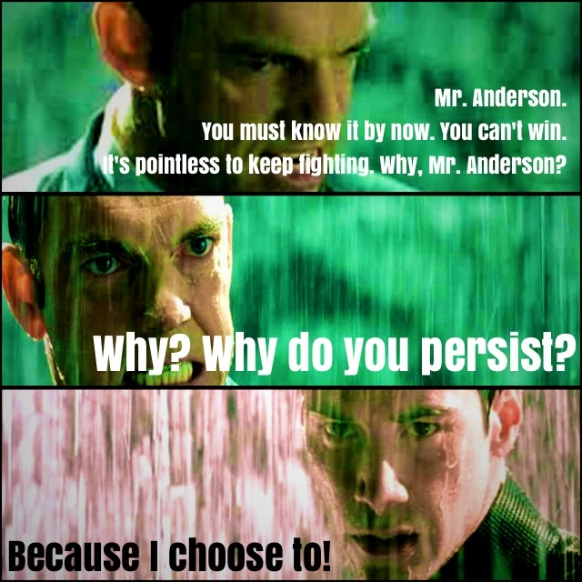
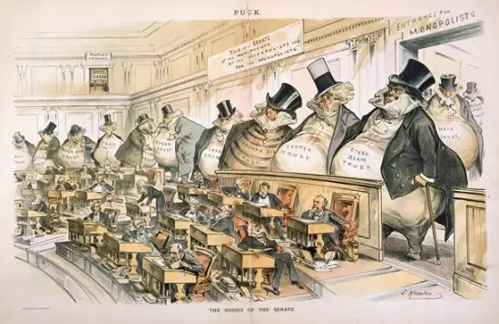

---
# This becomes the URL path to the article
slug: why-sxwl-ai
title: 我们为什么做算想云？
description: 介绍算想团队做算想云的初衷
authors: [zyx]
tags: [算想云]
---

距离算想云（llm.sxwl.ai）正式上线倒计时 3 天

算想云（llm.sxwl.ai）：Serverless 大模型训练云服务；以低于公有云 60%
的价格运行容器化的大模型训练任务，让更多小团队用得上大模型。 算想云将在北京时间
2023-11-13 10:00 正式上线，注册用户将免费获得 5 分钟 A100 GPU
时长（来自算想未来独家算力合作伙伴），同时我们将从注册用户中抽出一位幸运儿，
赠送终身可用的 ¥10000/月算想云大模型算力券。详情关注算想未来公众号！

<!-- truncate -->

## “AlphaGo’s victory inspired a new era of AI systems”

    
    
AlphGo-LeeSedol

2016 年，人类不可避免的为自己创造了超越自己的后继者，正如每一对父母消耗自己来
塑造下一代。

人类本能地寻找将文明延续的机制。当生物繁衍和教育的速度赶不上工程师迭代的冲动，AI
诞生了。那一天，Google HQ 43 号楼里欢呼雀跃的同事们，让我产生了无边的疏离感，
无力、无奈、无泪。

李世石的面孔，让我回想起参加 Warcraft 3
比赛面对强手时，那无边的无力感；屏幕上对手的单位排山倒海涌向我的基地，
已知毫无胜算，双手不由自主抖动、鼠标也无法拿稳。

李世石不知道的是，AlphaGo
背后，是数以百计的硅谷精英工程师、数千台服务器、无以计数的庞大数据、
以及数十年计算机科学家的呕心沥血。其中，也有算想未来团队所在
Google Borg 团队所构建的世界上最高效的云原生智算平台。

从一开始，这就不是一场公平的竞赛。曾经站在围棋世界之巅的李世石，此时也只是
Underdog。

## Underdog

<!--  -->

    
    
AlphGo-LeeSedol

我的人生经历数不胜数的不公；其中最令我愤怒的，发生在我最得意的时刻：

高二、我物理学得出色，暑假前，物理老师赠送一本王淦昌所编物理竞赛辅导书，
推荐我参加下一学期的物理竞赛；我从未接触过竞赛题目，
“光的压强”这样匪夷所思的问题，让从未接触过竞赛题目的我醍醐灌顶；自学之后，
不出意外，75/120，我考到全校第一。

省考开始：物理老师带着我们 3 位同学，一起来到省城太原，面对宽阔的双向 4
车道马路，我不知所措地感慨：都市的繁华是如此大的冲击。

没有人预料这只是难以承受之冲击的帷幕。

省考结束，12/150，校考第一的我，3 人中唯一没有获奖。
后来成为我一生挚友的同学轻描淡写、安慰道：没事儿，咱们都是 10 几 20 分儿。

“毕竟、省实验中学的人，每个周末都要做奥赛培训，初中开始”

每个周末、从初中开始！？

但是我们的物理老师，并无此能力；复杂的实验仪器，学校并没有经费采购；而周末，
我们都在忙着模拟考试。

我一直自忖是 Underdog，也对社会资源分配不均有切身体会，但现实的不公，仍然远超我的想象。

## 望价兴叹的大模型看客

<!--  -->

    
    
AlphGo-LeeSedol

2018 年 OpenAI 以同样碾压的优势击败了 Dota2 人类世界冠军
OG；我并不伤感，因为当年的 underdog 是 LGD。

ChatGPT 为代表的大模型对我的冲击，远远不及 AlphaGo、OpenAI
Five；只是让我在热潮之初，回忆起 2018 年末、2020 年初两次以 GPU 及 AI
芯片提供智算云服务的失败的融资经历。

2018 年，我带着 GPU Cloud 的概念，拿着一页纸找到了中国 2B 风投领域一位知名
投资人；这一次，我明白了风投融资的故事都是为极少幸存者书写的赞美诗。Underdog
们的故事，已经淹没在茶余饭后。

2020 年，我带着 Infrastructure for non-NVIDIA AI chips
的概念，拿着几十页纸的商业计划书参加了苏州某知名工业园区的路演大赛；
并随后成功说服了 Wave Computing （硅谷 Santa Clara）资深销售总监展开合作；
但很快 Wave Computing 的可重构 AI 芯片流片失败、破产；后来我也明白，
政府园区的路演，背后的胜出者，早已内定。

2023 年，倒卖 GPU 的代理商们骚扰我的微信，算力开支让满怀理想的公司捉襟见肘、
举步维艰，头部团队因为出身巨头而轻松获得巨量 GPU 及融资，顺风顺水到抑郁；
我想起那夜，我与同学坐在山西大学教学楼旁的马路牙子上满怀憧憬等待物理奥赛省赛
的成绩单：希望、绝望、沮丧、愤怒、无力。

## 算想云：让大模型触手可及

你应该明白我们为什么做算想云、为什么要在中国做算想云。

你再也不用感慨人生之不公：你那有趣的大模型应用场景，因为买不起 GPU、租不起 3
年起租的公有云 GPU 服务器而无疾而终。
