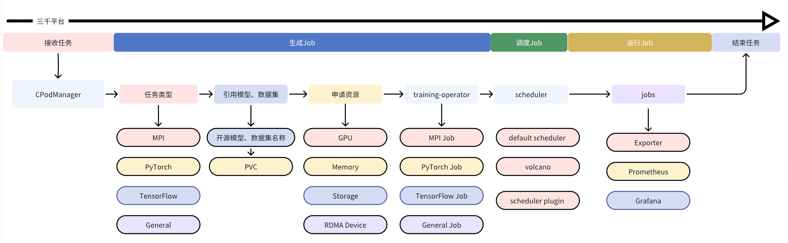

# 任务生命周期

## 接收任务
CPodManager 作为总接口接收用户提交的训练任务，提交任务时需提供如下参数：
  - 任务类型
  - 容器镜像
  - 启动命令
  - 模型名称
  - 模型读取路径
  - 数据集名称
  - 数据集读取路径
  - CheckPoint 保存路径
  - Saved-Model 保存路径
  - GPU 类型
  - GPU 数量 
  - 存储大小
  - 内存大小

## 处理任务类型
- 三千平台目前支持如下几种任务类型，可根据不同训练框架选择对应的任务类型：
  - MPIJob
  - PyTorchJob
  - TensorFlowJob
  - GeneralJob
- 根据提交的任务类型生成相应 Job 的 yaml 格式配置
- 根据提交任务的启动命令配置 Job Pod 拉起后执行的训练程序

## 处理模型、数据集
- 三千平台可对常用开源模型及数据集提供预缓存，预缓存的模型和数据集会生成全局唯一的名称，并存入以唯一名称命名的 PVC 内
- 已经预缓存的模型、数据集信息会以 CRD 的方式注册到 Kubernetes 集群，以供 CPodManager 查询调用
- 根据任务提交的模型、数据集名称，检查已注册的 CRD，获取相应的 PVC，并配置挂载到 Job 的 POD
- 模型、数据集所属的 PVC 将以 ReadOnlyMany 的方式进行挂载

## 处理申请资源
- 根据任务申请的 GPU、内存、RDMA Device 资源，配置 Job 所属 POD 的资源 requests、limits
- 根据任务申请的存储空间动态创建 PVC，并配置挂载 CheckPoint 以及 Saved-Model 路径
- CheckPoint、Saved-Model 所属的 PVC 以 ReadWriteMany 的方式进行挂载

## 启动任务
- 处理完上述 Job 配置，CPodManager 调度 training-operator 完成任务启动，拉起任务对应的Pods
- 在 Pod 调度策略上，针对分布式训练任务，使用 Volcano 做为调度器，支持批量调度（Gang Scheduling）

## 任务容错机制
- 在任务运行期间发生错误，POD 内部 restartPolicy 策略为 OnFailure
- POD 层级如果发生异常退出，由 Kubernetes 确保重新调度并拉起任务 POD 
- 对于训练是否能根据 CheckPoint 输出继续运行，则需要训练程序来进行保障，三千平台对此不做特殊处理
