# 使用指南

## 名词解释
- `算想云`：llm.sxwl.ai，Serverless（无服务器）大模型训练云服务
- `算力用户`：寻求强大计算能力以满足高级数据科学和算法工程需求的专业用户

## 注册、登录
在算想云上，有算力需求的用户可以通过 Serverless（无服务器）云服务的方式以及比公有云低 60% 的价格使用算力服务。

### 免注册登录
可以使用有效邮箱接收验证码直接登录算想云：
- 步骤1：输入有效邮箱地址，点击`获取验证码`
- 步骤2：打开邮箱，查看收到的验证码并输入
- 步骤3：点击登录


### 注册
- 登录 https://llm.sxwl.ai ，选择`注册`
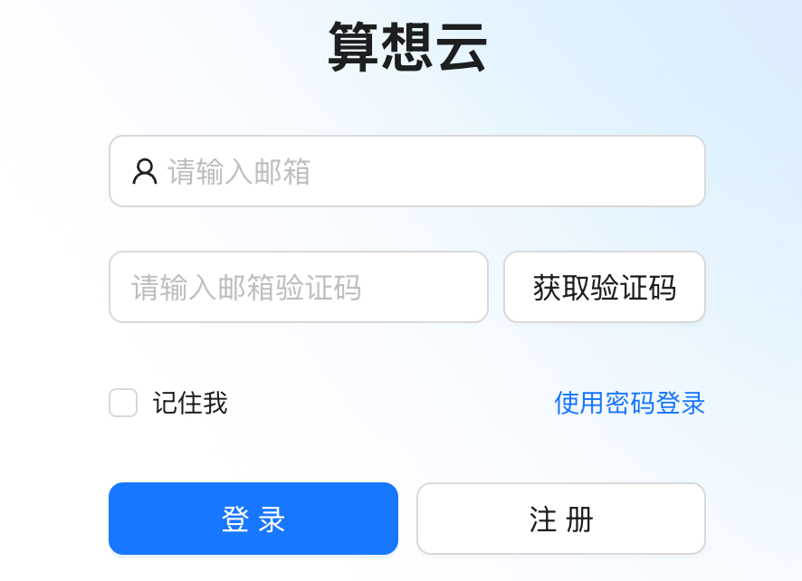

- 选择`算力用户注册`并填写注册相关信息，点击`注册`完成用户注册
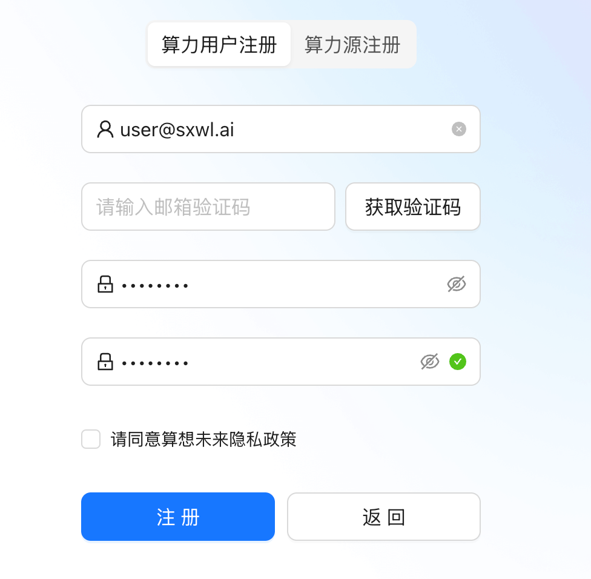

### 登录
- 打开算想云登录页面 [https://llm.sxwl.ai/login](https://llm.sxwl.ai/login)，选择`使用密码登录`
- 输入注册邮箱和密码，点击`登录`
- 登陆成功后，自动进入`模型仓库`页面
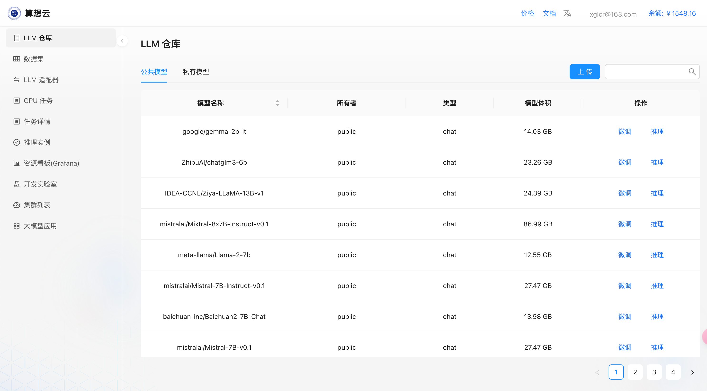

## 模型仓库
算想云提供主流开源的模型仓库，用户可以基于开源模型快速发起微调、推理等操作；

## 微调
- 在`LLM仓库`中选择需要的模型，点击右侧`微调`操作按钮发起微调任务；
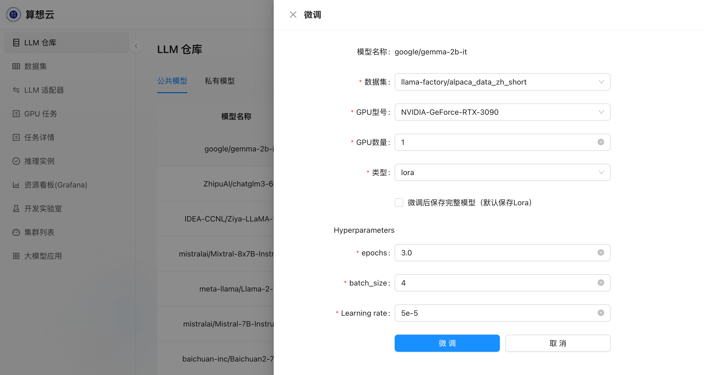
- 选择微调所用的`数据集`以及`GPU型号`即可提交发起微调；
- 微调任务提交后自动跳转到`任务详情`页，此时可看到发起的微调任务列表；
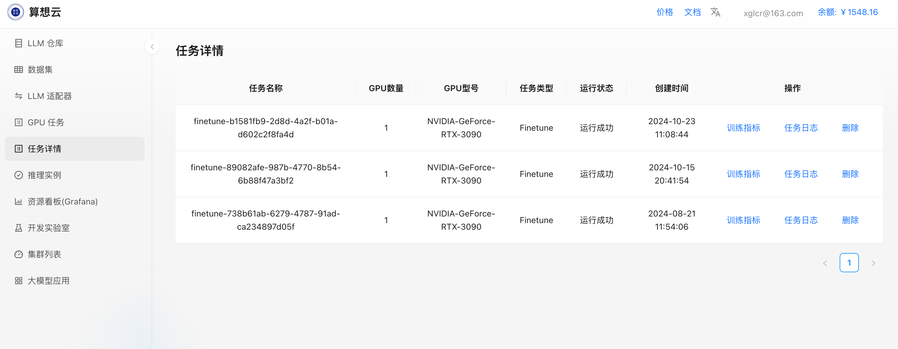
- 点击微调任务右侧的`训练指标`、`任务日志`可以查看任务的更多详细信息；

## 推理
- 在`LLM仓库`中选择需要部署推理的模型，点击右侧`推理`操作按钮发起推理部署；
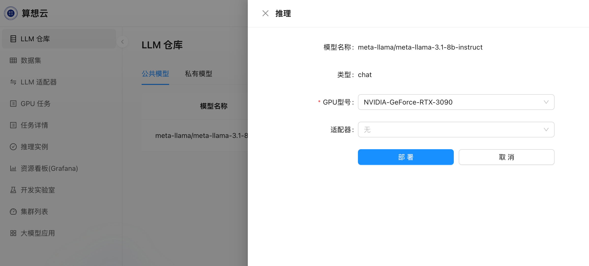
- 选择`GPU型号`即可提交发起推理部署；
- 推理部署任务提交后自动跳转到`推理实例`页面，此时可看到发起的推理部署实例；
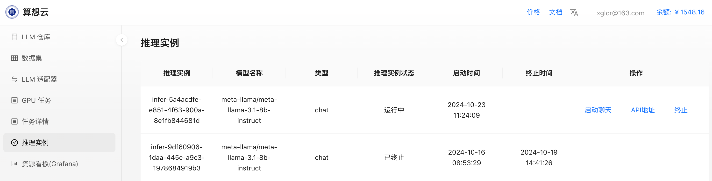
- 点击推理实例右侧的`启动聊天`即可打开 chatUI 进行推理对话；
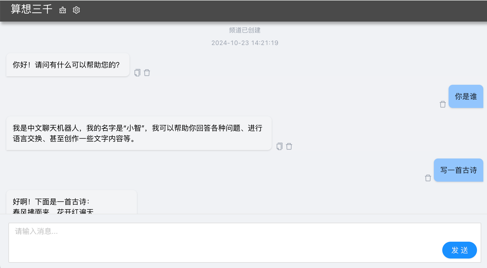

## 开发实验室
通过`开发实验室`，用户可以快速创建 JupyterLab、LLaMaFactory 实例；
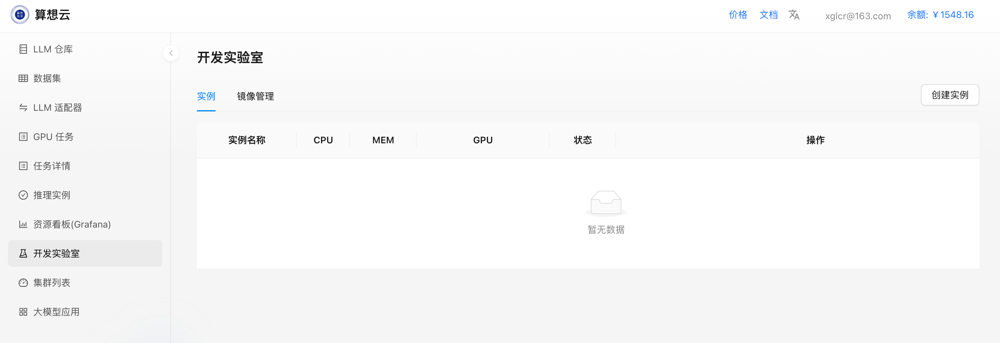
- 点击右上角`创建实例`
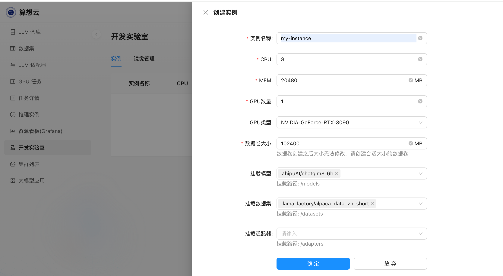
- 填写实例需要申请的cpu、内存、gpu、存储等资源；
- 选择是否需要挂载模型、数据集、适配器到实例（可选）；
- 提交后开始创建实例;
- 创建完成后，可通过点击`JupyterLab`、`LLaMa-Factory`操作按钮进入相应界面；

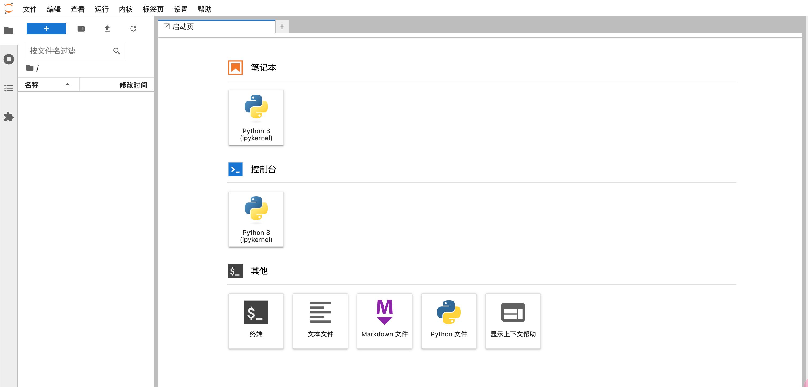
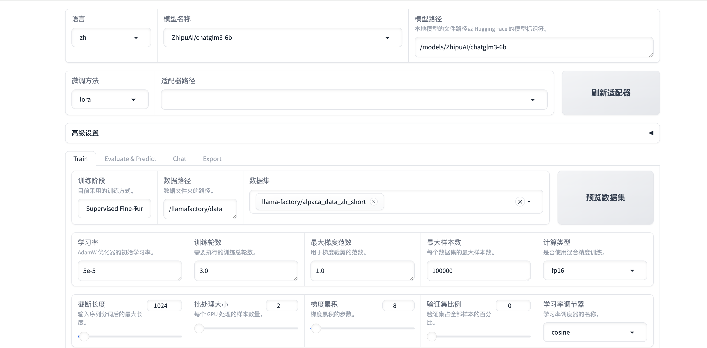

## 大模型应用
依托算想云本地化部署的推理，可以通过`大模型应用`快速部署相关的应用，目前算想云上架了`知识库`应用，可快速部署构建基于 RAG 的知识库；
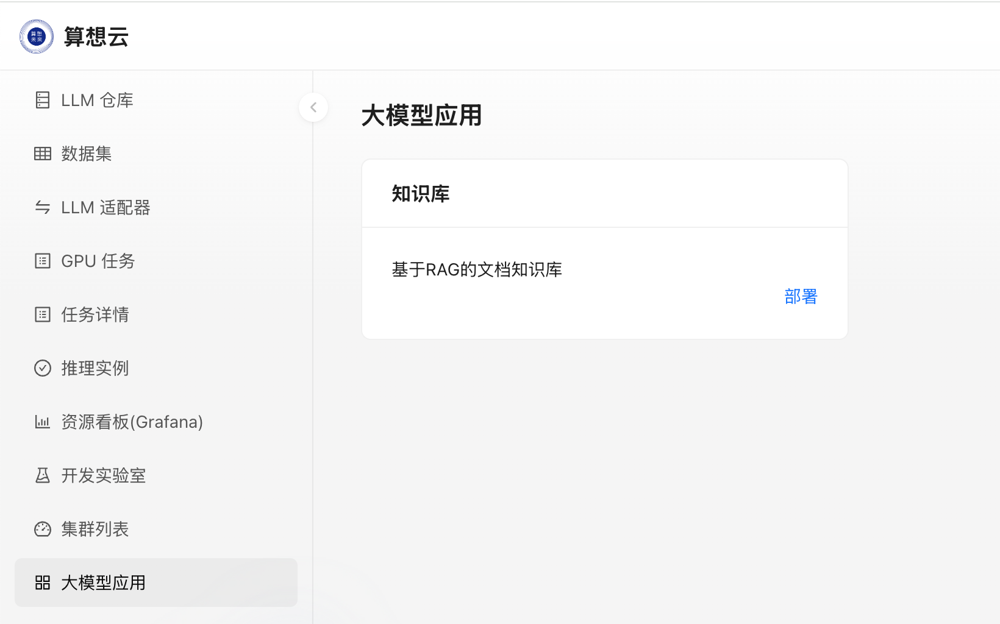
- 点击`部署`，选择模型推理实例，即可发起知识库的实例部署；
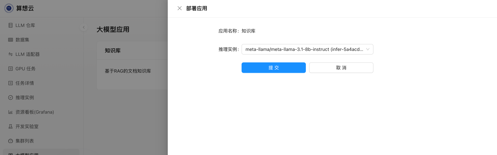
- 部署完成后，点击`访问知识库`即可进入知识库页面；
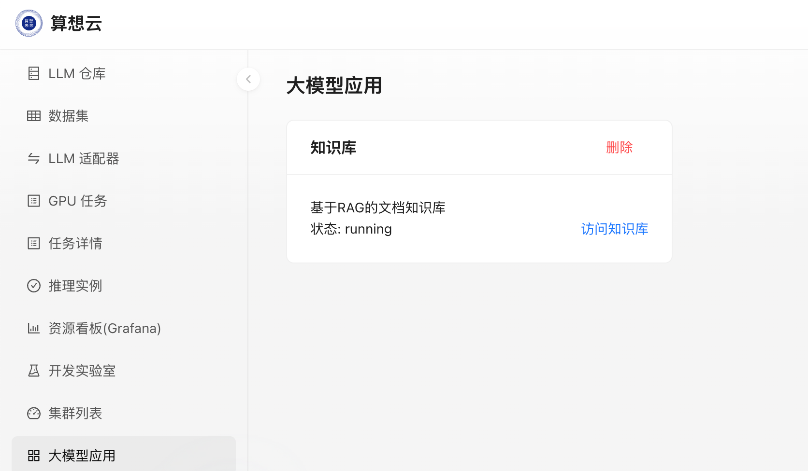
- 在知识库`管理`页面中上传文档，即可基于上传的文档进行知识库问答了；
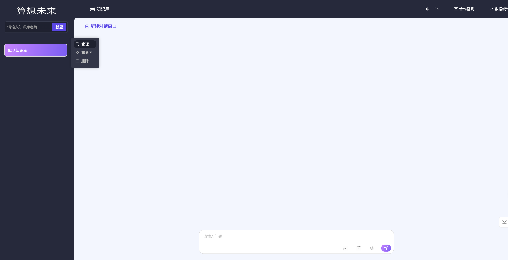
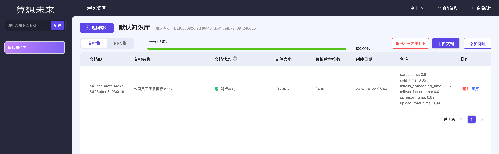
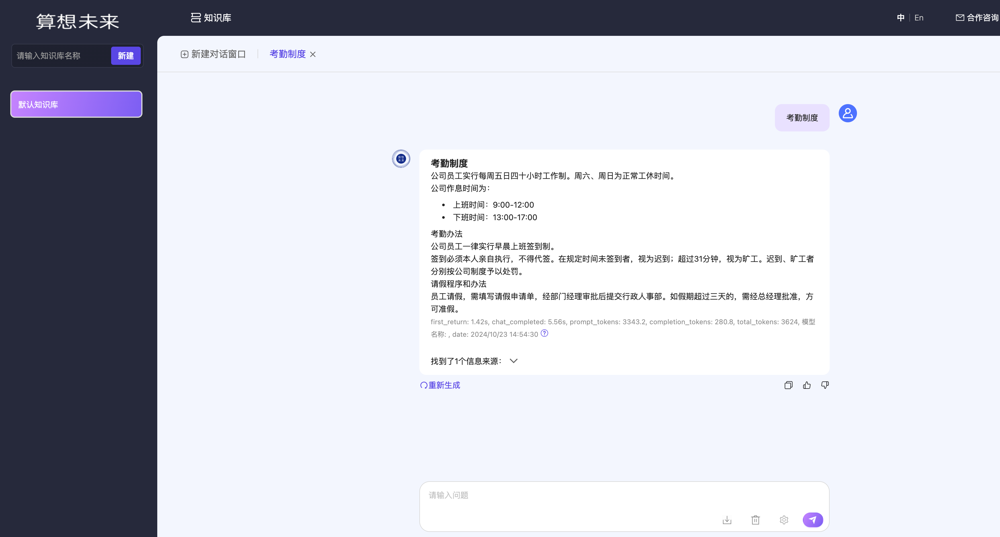

## 提交自定义训练任务
`GPU任务`页面是算力用户提交自定义训练任务的入口，通过提交训练任务，用户可以直接使用算想云提供的算力进行任务训练，不用操心基础设施以及基础服务的搭建；
提交训练任务需提供以下信息：
- `CKPT 路径`：训练过程中产生的数据存放路径，对应用户训练程序中设置的路径
- `模型保存路径`：训练完成后的模型保存路径，对应用户训练程序中设置的保存路径
- `容量`：CKPT 路径及模型保存路径将挂载对应的 PV ，容量是需要申请的 PV 大小，根据训练预估数据量大小填写
- `GPU`：训练所需的 gpu 资源数量以及类型
- `容器镜像`：用户需要将训练程序、训练数据以及所需环境打包成镜像，并将镜像上传到公网可访问的镜像仓库，镜像打包过程可参考附录一
- `任务类型`：目前支持的任务类型为MPI
- `终止条件`：可选择自然终止或手动设定运行时长，在设置运行时长到期后如任务未完成，该训练任务将被终止
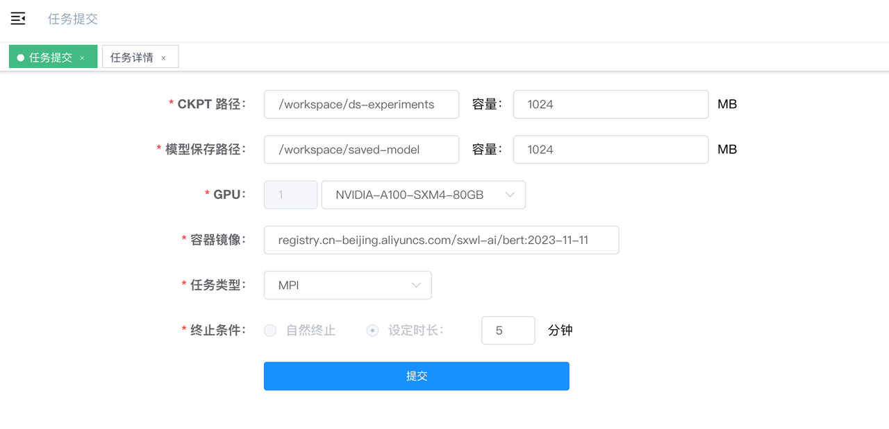

以下是一个bert训练任务提交的参数示例，可用于体验任务提交流程：
- `CKPT路径`: /workspace/ds-experiments `容量`：1024
- `模型保存路径`：/workspace/saved-model `容量`：1024
- `GPU`：NVIDIA-A100-SXM4-80GB
- `容器镜像`：registry.cn-beijing.aliyuncs.com/sxwl-ai/bert:2023-11-11
- `任务类型`：MPI

## 任务详情
- 训练任务提交后自动进入`任务详情`页面，此时任务进入`运行`状态，点击详情可查看该任务的运行详情（待上线）：
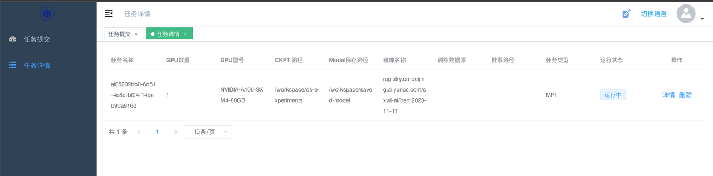

- 任务运行完成后，可以看到操作中出现`下载模型`操作，点击`下载模型`弹出模型文件列表，点击链接可进行模型下载

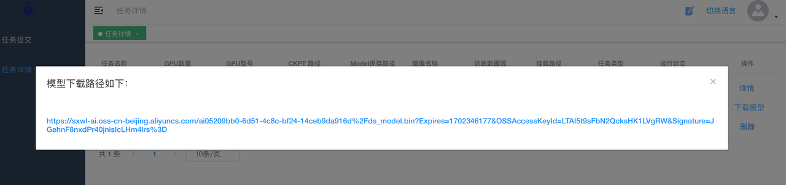

## 附录一
> 构建能够运行在算想云上的训练镜像

以编写一个用来训练 Bert 的最基本的 Dockerfile 作为示例：
```dockerfile
FROM registry.ap-southeast-1.aliyuncs.com/sxwl-ai/cuda_base:2023-10-23
WORKDIR /workspace
RUN wget --progress=dot:giga https://sxwl-ai.oss-cn-beijing.aliyuncs.com/hf-datasets/hf_wikitext.tar.gz && \
    mkdir dataset && tar zxvf hf_wikitext.tar.gz --directory dataset && \
    rm hf_wikitext.tar.gz

# Allow editing source file when exec inside the container
RUN apt-get update --fix-missing && apt-get install -y vim --fix-missing
COPY *.py ./
COPY model_roberta_base ./model_roberta_base

CMD mpirun -np "1" --allow-run-as-root -bind-to none -map-by slot -x NCCL_DEBUG=INFO -x NCCL_P2P_DISABLE=1 -x LD_LIBRARY_PATH -x PATH -mca mpi_warn_on_fork "0" python3 train_bert_ds.py --checkpoint_dir ds-experiments --dataset_dir dataset/wikitext --num_iterations=1000
```

- `FROM` 引入了一个基础环境镜像，里边包含 bert 训练所需的运行环境
- `RUN` 中将训练所需的数据放到了 dataset 目录下，将数据一起打包到镜像里
- `CMD` 中指定了镜像拉起后执行的训练程序，并指定了训练数据所在的目录，以及 CKPT 所在的路径
> CMD 中 mpirun 指定的 -np 参数需与申请的 gpu 资源数量一致，目前暂时只能设置为 1

