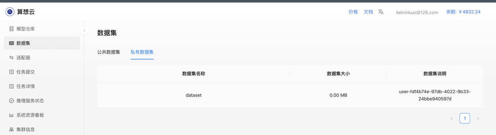
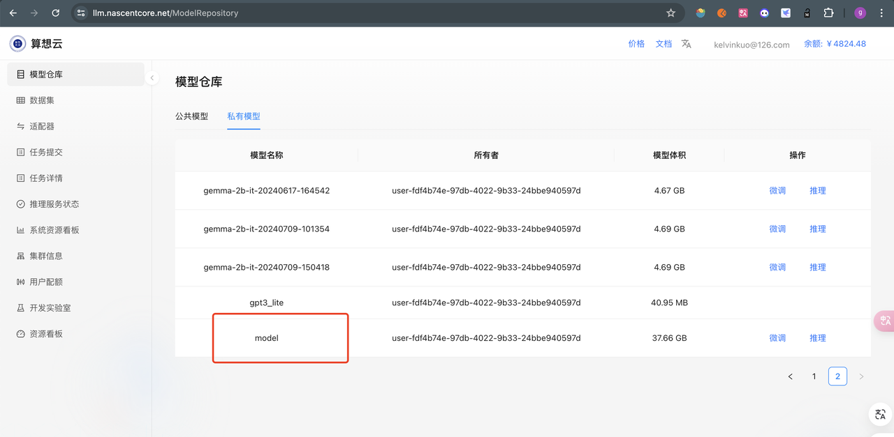

如果你在本地已经运行成功 基于 huggingface（使用 huggingface 模型、数据集、pip 包的）的项目，本文介绍如何将其移植到算想云来，在算想云中运行。下面是一份 [示例](https://www.datacamp.com/tutorial/fine-tuning-llama-2)，使用 huggingface hub 上的数据集 NousResearch/Llama-2-7b-chat-h 对 NousResearch/Llama-2-7b-chat-hf 模型进行 lora 微调 。

```python

import os
import torch
from dataset import  load_dataset
from transformers import (
    AutoModelForCausalLM,
    AutoTokenizer,
    BitsAndBytesConfig,
    HfArgumentParser,
    TrainingArguments,
    pipeline,
    logging,
)
from peft import LoraConfig, PeftModel
from trl import SFTTrainer

# Model from Hugging Face hub
base_model = "NousResearch/Llama-2-7b-chat-hf"

# New instruction dataset
guanaco_dataset = "mlabonne/guanaco-llama2-1k"

dataset = load_dataset(guanaco_dataset, split="train")

compute_dtype = getattr(torch, "float16")

quant_config = BitsAndBytesConfig(
    load_in_4bit=True,
    bnb_4bit_quant_type="nf4",
    bnb_4bit_compute_dtype=compute_dtype,
    bnb_4bit_use_double_quant=False,
)

model = AutoModelForCausalLM.from_pretrained(
    base_model,
    quantization_config=quant_config,
    device_map={"": 0}
)
model.config.use_cache = False
model.config.pretraining_tp = 1

# Load LLaMA tokenizer
tokenizer = AutoTokenizer.from_pretrained(base_model, trust_remote_code=True)
tokenizer.pad_token = tokenizer.eos_token
tokenizer.padding_side = "right"

# Load LoRA configuration
peft_args = LoraConfig(
    lora_alpha=16,
    lora_dropout=0.1,
    r=64,
    bias="none",
    task_type="CAUSAL_LM",
)

# Set training parameters
training_params = TrainingArguments(
    output_dir="./workspace/saved_model",
    num_train_epochs=1,
    per_device_train_batch_size=4,
    gradient_accumulation_steps=1,
    gradient_checkpointing=True,
    optim="paged_adamw_32bit",
    save_steps=25,
    logging_steps=25,
    learning_rate=2e-4,
    weight_decay=0.001,
    fp16=False,
    bf16=False,
    max_grad_norm=0.3,
    max_steps=-1,
    warmup_ratio=0.03,
    group_by_length=True,
    lr_scheduler_type="constant",
    report_to="tensorboard"
)

# Set supervised fine-tuning parameters
trainer = SFTTrainer(
    model=model,
    train_dataset=dataset,
    peft_config=peft_args,
    dataset_text_field="text",
    max_seq_length=None,
    tokenizer=tokenizer,
    args=training_params,
    packing=False,
)

# Train model
trainer.train()

```

你能在本地运行良好，你需要做一下步骤能够将它在算想云 cpodjob 中运行。

1. 上传模型和数据集到算想云仓库中
2. 代码改造（从本地加载模型数据集）
3. 制作并上传镜像
4. 在算想云创建 cpodjob

## 准备模型数据集

从 huggingface 下载数据集，并上传

```bash

export HF_ENDPOINT=https://hf-mirror.com

huggingface-cli download --repo-type dataset --resume-download mlabonne/guanaco-llama2-1k  --local-dir dataset

 sxwlctl  upload  -r dataset -d  /data2/dg/dataset/
```

查看数据集是否上传成功


下载模型并上传

```bash

huggingface-cli download --resume-download NousResearch/Llama-2-7b-chat-hf  --local-dir model

sxwlctl upload -r model -d /data2/dg/model/model -t llama2 -v

```



## 代码改造

根据下面 diff 修改训练代码

```diff
import os
import torch
from datasets import load_dataset
from transformers import (
    AutoModelForCausalLM,
    AutoTokenizer,
    BitsAndBytesConfig,
    HfArgumentParser,
    TrainingArguments,
    pipeline,
    logging,
)
from peft import LoraConfig, PeftModel
from trl import SFTTrainer

# Model from Hugging Face hub
-base_model = "NousResearch/Llama-2-7b-chat-hf"
+base_model = "/data/model"

# New instruction dataset
-guanaco_dataset = "mlabonne/guanaco-llama2-1k"
+guanaco_dataset = "/data/dataset"

dataset = load_dataset(guanaco_dataset, split="train")

compute_dtype = getattr(torch, "float16")

quant_config = BitsAndBytesConfig(
    load_in_4bit=True,
    bnb_4bit_quant_type="nf4",
    bnb_4bit_compute_dtype=compute_dtype,
    bnb_4bit_use_double_quant=False,
)

model = AutoModelForCausalLM.from_pretrained(
    base_model,
    quantization_config=quant_config,
    device_map={"": 0}
)
model.config.use_cache = False
model.config.pretraining_tp = 1

# Load LLaMA tokenizer
tokenizer = AutoTokenizer.from_pretrained(base_model, trust_remote_code=True)
tokenizer.pad_token = tokenizer.eos_token
tokenizer.padding_side = "right"

# Load LoRA configuration
peft_args = LoraConfig(
    lora_alpha=16,
    lora_dropout=0.1,
    r=64,
    bias="none",
    task_type="CAUSAL_LM",
)

# Set training parameters
training_params = TrainingArguments(
    output_dir="/workspace/saved_model",
    num_train_epochs=1,
    per_device_train_batch_size=4,
    gradient_accumulation_steps=1,
    gradient_checkpointing=True,
    optim="paged_adamw_32bit",
    save_steps=25,
    logging_steps=25,
    learning_rate=2e-4,
    weight_decay=0.001,
    fp16=False,
    bf16=False,
    max_grad_norm=0.3,
    max_steps=-1,
    warmup_ratio=0.03,
    group_by_length=True,
    lr_scheduler_type="constant",
    report_to="tensorboard"
)

# Set supervised fine-tuning parameters
trainer = SFTTrainer(
    model=model,
    train_dataset=dataset,
    peft_config=peft_args,
    dataset_text_field="text",
    max_seq_length=None,
    tokenizer=tokenizer,
    args=training_params,
    packing=False,
)

# Train model
trainer.train()

```

## 制作镜像

```Dockerfile
FROM sxwl-registry.cn-beijing.cr.aliyuncs.com/sxwl-ai/pytorch:2.3.1-cuda12.1-cudnn8-runtime

WORKDIR /workspace

RUN pip install -i  https://pypi.tuna.tsinghua.edu.cn/simple accelerate peft bitsandbytes transformers trl tensorboard

COPY train.py ./

CMD ["python", "train.py"]

```

编译并上传镜像

```bash
$ tree .
.
├── Dockerfile
└── train.py

docker build -t sxwl-registry.cn-beijing.cr.aliyuncs.com/sxwl-ai/llama-2-7b-demo:v1 .

docker push sxwl-registry.cn-beijing.cr.aliyuncs.com/sxwl-ai/llama-2-7b-demo:v1


```

## 算想云创建 cpodjob


