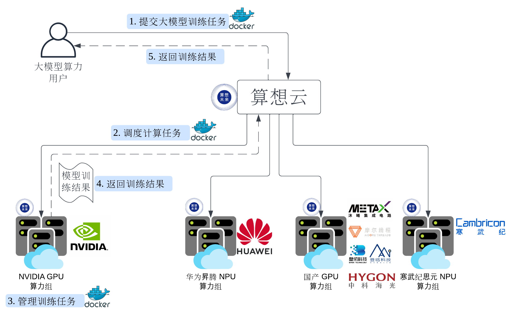

# Serverless 与算想云

## 什么是 Serverless/无服务器？

[算想云](https://llm.sxwl.ai)是 Serverless 大模型训推云服务，提供开箱即用、
随需随用、先用后付的大模型训练、推理服务。

Serverless 指用户提交容器镜像任务、指定 GPU 资源，由算想云完成任务执行的
全生命周期的各项操作：资源调配、任务管理、可观测性等等。整个过程中用户感知不到
任何传统服务器或者近似的概念，因此被称为 Serverless 或无服务器。

[AWS](https://aws.amazon.com/cn/campaigns/serverless/) 更为全面地描述了
Serverless 的概念。

Serverless 在 Google 已经广泛应用超过 15 年，自 2008 年起，
就在 Google Borg 平台上实现了容器形式的 Serverless 任务运行和管理。

Google Borg 是容器和云原生技术，及 Kubernetes 的发源地；算想未来团队来自 Google
Borg，并参与了 GPU/TPU 调度、高性能 RDMA 网络等大模型智算平台核心技术的研发。

## 算想云如何实现 Serverless 大模型训推云服务？

