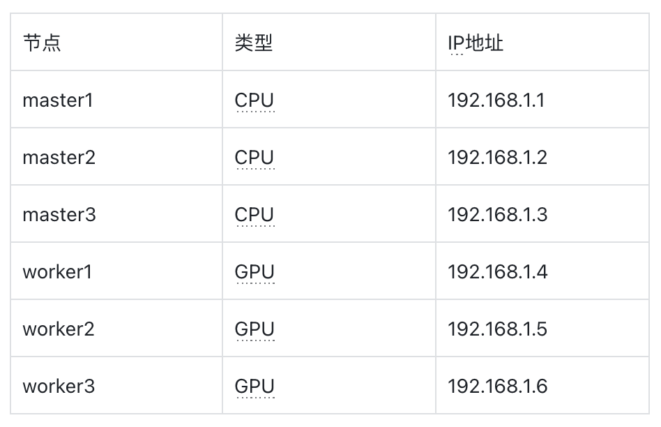
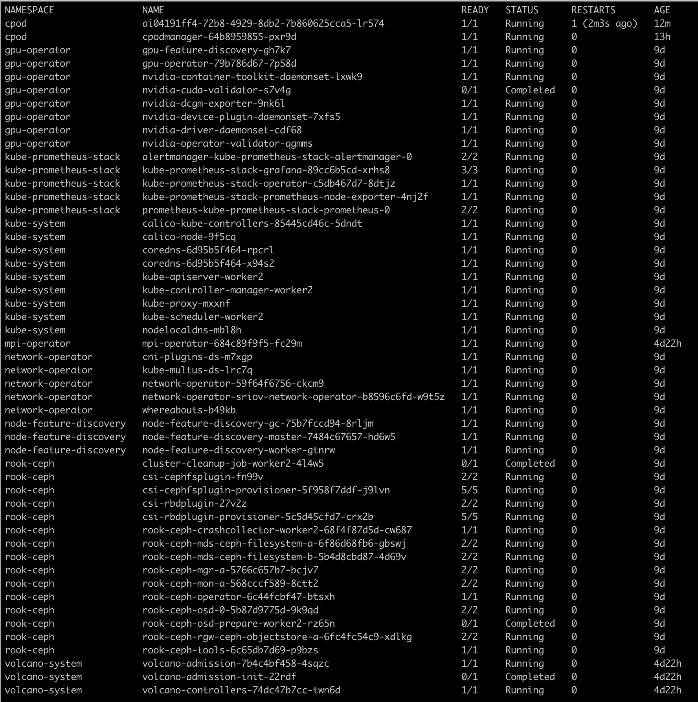

# 安装部署指南

## 简介
三千平台是基于 kubernetes 管理算力优化服务大模型的算力平台，采用云原生架构和使用体验，聚焦算力管理和优化。

## 硬件要求
- master节点：cpu服务器 4C8G * 3（可用虚拟机）
- worker节点：gpu服务器 * n
- 存储节点：复用 worker 节点裸盘或单独提供

## 组件介绍
- Kubernetes 集群
- CPodManager 算力组管理器，三千平台对外总接口，管理调度其他组件
- Operators
  - node-feature-discovery 用于检测 Kubernetes 集群中每个 Node 的特性能力，并将这些能力以 label 的方式发布到 Master Scheduler 上，使集群调度可以更加智能的调度 Pod 到最佳节点上运行；
  - gpu-operator 用于在 Kubernetes 集群中部署和管理 Nvidia GPU；
  - network-operator 用于配置网络、RDMA 以及 GPUDirect；
  - training-operator 用于支持并行分布式训练在 Kubernetes 集群上部署运行的组件；
  - kube-prometheus-stack 监控告警组件，包括 alertmanager/grafana/prometheus 等子组件；
- Ceph 集群
  - rook-ceph 一个云原生存储编排器，提供基于 kubernetes 调度和编排 ceph 集群的功能；
  - rook-ceph-cluster 在 kubernetes 上部署的 ceph 集群；

## 快速安装
三千平台提供 CLI 工具 3kctl 以便快速部署整个集群环境，本节介绍如何通过 3kctl 快速部署。

### 环境准备
- 本手册以如下机器配置为例进行安装部署指南：

  
- 所有节点建立 ssh 互信
```bash
# 在 master1 上生成密钥对，并将公钥复制到所有节点
ssh-keygen -t rsa
ssh-copy-id lanyun@192.168.1.1
ssh-copy-id lanyun@192.168.1.2
ssh-copy-id lanyun@192.168.1.3
ssh-copy-id lanyun@192.168.1.4
ssh-copy-id lanyun@192.168.1.5
ssh-copy-id lanyun@192.168.1.6
```

### 下载并解压离线安装包
```bash
cd /opt
wget https://sxwl-ai.oss-cn-beijing.aliyuncs.com/antifacts/3k-artifact.tgz
tar xvf 3k-artifact.tgz && cd artifact
```

### 修改集群配置
修改集群配置文件`conf/config-sample.conf`，按实际集群节点信息填写
```yaml
hosts:
  - {name: master1, internalAddress: 192.168.1.1, port: 22, user: root, privateKeyPath: "/root/.ssh/id_rsa"}
  - {name: master2, internalAddress: 192.168.1.2, port: 22, user: root, privateKeyPath: "/root/.ssh/id_rsa"}
  - {name: master3, internalAddress: 192.168.1.3, port: 22, user: root, privateKeyPath: "/root/.ssh/id_rsa"}
  - {name: worker1, internalAddress: 192.168.1.4, port: 22, user: root, privateKeyPath: "/root/.ssh/id_rsa"}
  - {name: worker2, internalAddress: 192.168.1.5, port: 22, user: root, privateKeyPath: "/root/.ssh/id_rsa"}
  - {name: worker3, internalAddress: 192.168.1.6, port: 22, user: root, privateKeyPath: "/root/.ssh/id_rsa"}
  roleGroups:
    etcd:
    - master[1:3]
    control-plane:
    - master1
    worker:
    - worker[1:3]
    registry:
    - master1
```

### 部署平台
部署三千平台，此处`ACCESS_KEY`的值为用户在算想云注册后生成的`accessKey`
```bash
ACCESS_KEY=
sudo ./3kctl deploy all --access-key=${ACCESS_KEY}
```

### 按需部署`ceph`集群
```bash
sudo ./3kctl deploy install ceph
```

### 查看集群信息
```bash
kubectl get pods -A
```

